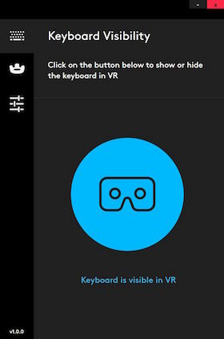
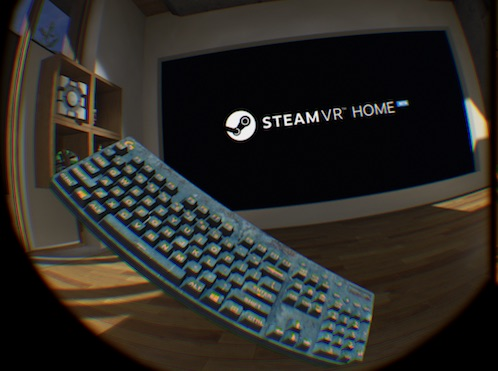
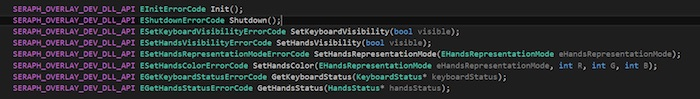

# Logitech Bridge SDK

- BETA version **1.0.0** (released on July 27th 2017)
- PREVIOUS: 0.8.3 released on May 10th 2017
- Contact: bridgesdk@logitech.com

## Introduction:
The Bridge SDK is a Development kit that aims at helping app makers and other SW developers to solve some of the issues arising whenever a person needs to use a Keyboard in VR.

## Motivation:
The motivation comes from the belief that in some situations the user still needs to use a keyboard to interact with the applications, especially in productivity-driven scenarios but also in games, chat and content browsing. We believe that that keyboard has to be physically present, since it delivers the traditional tactile experience and feedback that people value.

## The Pieces:
The Bridge SDK is composed of the following elements:

- A Logitech G810 Keyboard (off-the-shelf)
- A Logitech “BRIDGE adapter”
- A HTC tracker 
- A SW installer that enables an “overlay” of a 3D VR keyboard

## Setup instructions:
We are still working on an installer, so as of now you can simply head to the [installer](https://github.com/Logitech/logi_bridge_sdk/tree/master/installer) folder and download the [zip file](https://github.com/Logitech/logi_bridge_sdk/tree/master/installer/v083_Logitech_Bridge-win32-x64.zip) and unzip it on your machine (in any folder you like). In order to launch/activate the Bridge Overlay SW, you simply launch Logitech_Bridge.exe. from the extracted folder. 

*Note: Remember it is still in beta and the binary is currently unsigned, therefore you might need to unblock/allow it to run manually (depending on which version of Windows you are using).*

Read the supplied [documentation](https://github.com/Logitech/logi_bridge_sdk/tree/master/documentation/BRIGE_SDK_description_v1.0.pdf) for more detailed  instructions.

## Functionality:

### Keyboard Model Overlay

The overlay package is fully compatible with all application that is developed based on STEAM VR (©Valve). To launch it, double click on Logitech_Bridge.exe contained in the previously unzipped folder.

 <i>fig1. main UI panel of the BridgeSDK</i>

After launching it will add a system tray icon. You can open it by clicking on it. This UI is an easy wrapper to the main core Bridge SDK (running behind the scenes) and allows to overlay a virtual representation of the keyboard in any VR application game: It acts in fact as an additional “virtual” Headset that has his own view that is virtually placed right in front of the user’s HMD’s view.

The keyboard will appear as soon as the associated HTC tracker is turned on (options to toggle visibility are available) and the user will be able to see it "floating" above any app.

It will render a 3D representation of a G810 keyboard, complete with animations when the keys are pressed. Some different skins are also included.

 <i>fig2. Keyboard Model ovelay over SteamVR (TM) home beta</i>

### Hands (*NEW)

Starting from release 1.0.0, the BridgeSDK also include the ability to overlay your hands on top of the 3D keyboard model. We believe this is a much needed feature to allow any person to type in VR (touchtypist & non). Please read the related chapter in the documentation file.

 <i>fig3. Typical representation of hands over the keyboard (mode Ghost)</i>

### API (*NEW)

Starting from release 1.0.0 the BridgeSDK offers the ability to be customized and be interfaced with an API. This is not mandatory, but the VR application can use this API in order to set certain modes, change color, select options for the Keyboard and hands layer. See the related chapter in the documentation file to get more details on that.

 <i>fig4. API set available in BridgeSDK</i>

The API uses a Standard C++ interface to a Dynamic Link Library (dll). We plan on releasing a plugin for Unity too in the near feature. There is also a MS Visual Studio sample app that shows how to interface to the BridgeSDK via the API.

## Feedback & Bugs:
We  strongly suggest to use our private GitHub repository for bug reports and features requests. Follow this [link](https://github.com/Logitech/logi_bridge_sdk/issues) and post it there. This will allow easier tracking and followup.

If you have any other generic questions or comments, please feel free to contact us on bridgesdk@logitech.com. 
