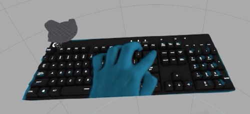

# Logitech G BridgeSDK

- Beta version **1.1.0** (released on Nov 8th 2017)
- Contact: supportsdk@logitech.com
- Instructions [wiki](https://github.com/Logitech/logi_bridge_sdk/wiki)

 

## Introduction
The Bridge SDK is a Development kit that aims at helping app makers and other SW developers to solve some of the issues arising whenever a person needs to use a Keyboard in VR.

 

## Motivation
The motivation comes from the belief that in some situations the user still needs to use a keyboard to interact with applications, especially in productivity-driven scenarios but also in games, chat and content browsing. We believe that that keyboard has to be physically present, since it delivers the traditional tactile experience and feedback that people value.

 

## The Pieces
The Bridge SDK is composed of the following elements:

- A Logitech G810 Orion Spark Keyboard (off-the-shelf)
- A Logitech G BRIDGE
- A HTC Vive tracker 
- A SW component that enables an “overlay” of a 3D VR keyboard

 

## Apply for the SDK
If you have not subscribed yet, and you are interested to get one of those DK (Development Kits), please apply [here](https://goo.gl/CJ16qD).

### Disclaimer
Please be aware that this is a BETA version of this SDK and in this current iteration it is purely a Proof of Concept to spark discussion and feedback from you, the development community. You can expect to see bugs and robustness issues, but we are working continuously to fix them. 

By running the software you accept that it will automatically collect anonymous information about how you use our software. We will not collect your name, email, address or any personally identifiable information and all data is anonymized.

### License Agreement
Downloading this SDK indicates that you have read and accept the terms of the License Agreement for the Logitech G Bridge in [here](https://goo.gl/sReQAk).

 

## Setup instructions
There is no need for an installer, so you can simply head to the [installer](https://github.com/Logitech/logi_bridge_sdk/tree/master/installer) folder and download the [zip file](https://github.com/Logitech/logi_bridge_sdk/tree/master/installer/v1.0.1_Logitech_BridgeSDK.zip) and unzip it on your machine (in any folder you like). In order to launch/activate the Bridge Overlay SW, you simply launch Logitech_Bridge.exe  from the extracted folder.
Read the supplied [documentation](https://github.com/Logitech/logi_bridge_sdk/tree/master/documentation/BRIGE_SDK_description_v1.0.pdf) for more detailed instructions.

 

## Functionality

### Keyboard Model Overlay

The overlay package is fully compatible with all application that is developed based on STEAM VR (©Valve). To launch it, double click on Logitech_Bridge.exe contained in the previously unzipped folder.

After launching it will add a system tray icon. You can open it by clicking on it. This UI is an easy wrapper to the main core Bridge SDK (running behind the scenes) and allows to overlay a virtual representation of the keyboard in any VR application game: It acts in fact as an additional “virtual” Headset that has his own view that is virtually placed right in front of the user’s HMD’s view.

 <i>Keyboard Model ovelay in Virtual Desktop</i>

The keyboard will appear as soon as the associated HTC tracker is turned on (options to toggle visibility are available) and the user will be able to see it "floating" above any app.

It will render a 3D representation of a G810 keyboard, complete with animations when the keys are pressed. Some different skins are also included.

### Hands

Starting from release 1.0.0, the BridgeSDK also include the ability to overlay your hands on top of the 3D keyboard model. We believe this is a much needed feature to allow any person to type in VR (touchtypist & non). Please read the related chapter in the documentation file.

 <i>Typical representation of hands over the keyboard (Ghost mode)</i>

### API

Starting from release 1.0.0 the BridgeSDK offers the ability to be customized and be interfaced with an API. This is not mandatory, but the VR application can use this API in order to set certain modes, change color, select options for the Keyboard and hands layer. See the related chapter in the documentation or our [Wiki](https://github.com/Logitech/logi_bridge_sdk/wiki/API) to get more details on that.

 <i>API set available in BridgeSDK</i>

### SW Samples

The API uses a Standard C++ interface to a Dynamic Link Library (dll). There is a MS Visual Studio sample app as well as a Unity project that shows how to interface to the BridgeSDK via the API. Check the [samples](https://github.com/Logitech/logi_bridge_sdk/tree/master/samples) folder.

 
 

## Feedback & Bugs
We  strongly suggest to use our private GitHub repository for bug reports and features requests. Follow this [link](https://github.com/Logitech/logi_bridge_sdk/issues) and post it there. This will allow easier tracking and followup.

If you have any other generic questions or comments, please feel free to contact us on supportsdk@logitech.com.

 

## Changelog
### 1.1.0 (Nov 8th 2017)
- many robustness improvments
- new align procedure
- bridge VR setup wizard app
- new hands segmentation methods

### 1.0.1 (Aug 16th 2017)
- added splash screen (while loading)
- Fixed some stability issues when SteamVR is not running
- Added autosave of Settings (included alignment) when app is being closed
- automatic lookup for open port for websocket interface

### 1.0.0 (Jul 28th 2017)
- added Hands support (based on HTC vive camera)
- added API support

### 0.8.3 (May 11th 2017)
- intial release (no hands support)
