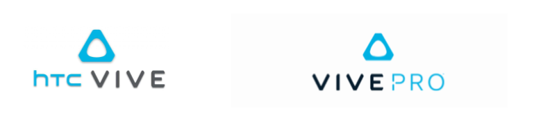
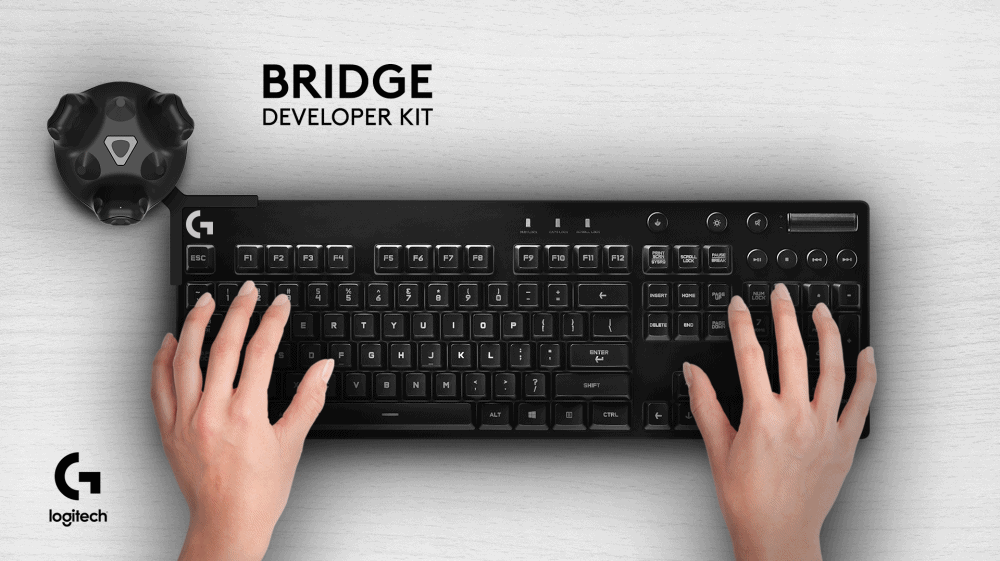
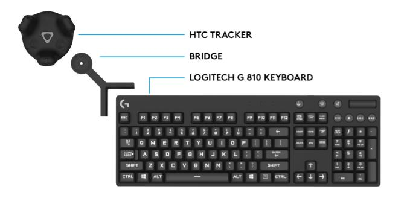

# Logitech G BridgeSDK

- Beta version [**2.0**](https://github.com/Logitech/logi_bridge_sdk/blob/master/software/README.md) (released on Aug 22th 2018)
- Contact: supportsdk@logitech.com
- Instructions [wiki](https://github.com/Logitech/logi_bridge_sdk/wiki)
 

## Platforms
Supports **HTC Vive** and **Vive PRO** (NEW since version 2.0)

 

## Introduction
The Bridge SDK is a Development kit that aims at helping app makers and other SW developers to solve some of the issues arising whenever a person needs to use a Keyboard in VR.

 

## Motivation
The motivation comes from the belief that in some situations the user still needs to use a keyboard to interact with applications, especially in productivity-driven scenarios but also in games, chat and content browsing. We believe that that keyboard has to be physically present, since it delivers the traditional tactile experience and feedback that people value.

 

## The Pieces
The Bridge SDK is composed of the following elements:

- A Logitech G810 Orion Spark Keyboard (off-the-shelf)
- A Logitech G BRIDGE
- A HTC Vive tracker
- A SW component that enables an “overlay” of a 3D VR keyboard

 

## Interested in the SDK?
Unfortunately we already have run out of Bridge adapters but we have been amazed to see the interest that this little experiment has sparked. 
We don't plan to pursue this initial avenue but we are currently working on new implementations of keyboard and tools in VR. 

If you are interested in knowing more about those, please subscribe [here](https://goo.gl/forms/WPb5uWU0NGPgZorP2).

 

## License Agreement
Downloading this SDK indicates that you have read and accept the terms of the License Agreement for the Logitech G Bridge in [here](https://goo.gl/sReQAk).

### Disclaimer
Please be aware that this is a BETA version of this SDK and in this current iteration it is purely a Proof of Concept to spark discussions and generate feedback from you, the development community. You can expect to see bugs and robustness issues, but we are working continuously to fix them.

By downloading or using the Logitech G Bridge SDK, developers accept the SDK License Agreement and agree that Logitech automatically collects anonymous diagnostic and usage data about the software, the Logitech Hardware and developers' computer with a purpose to facilitate the provisions of updates and to improve Logitech products.

 

## Setup instructions
There is no need for an installer, so you can simply download the latest releases's [zip file](https://github.com/Logitech/logi_bridge_sdk/releases) and unzip it on your machine (in any folder you like). In order to launch/activate the Bridge Overlay SW, you simply launch `Logitech_Bridge.exe` from the extracted folder (inside /vX.X.X_Logitech_BridgeSDK).

Have a look at those setup [instructions](software/README.md) or read the supplied [documentation](documentation/) for more detailed instructions.

 

## Functionality

### Keyboard Model Overlay

The overlay package is fully compatible with all applications that are developed based on STEAM VR (©Valve). To launch it, double click on Logitech_Bridge.exe contained in the previously unzipped folder.

After launching it will add a system tray icon. You can open it by clicking on it. This UI is an easy wrapper to the main core Bridge SDK (running behind the scenes) and allows to overlay a virtual representation of the keyboard in any VR application game: It acts in fact as an additional “virtual” Headset that has his own view that is virtually placed right in front of the user’s HMD’s view.

 <i>Keyboard Model ovelay in Virtual Desktop</i>

The keyboard will appear as soon as the associated HTC tracker is turned on (options to toggle visibility are available) and the user will be able to see it "floating" above any app. It will render a 3D representation of a G810 keyboard, complete with animations when the keys are pressed. Some different skins are also included.

The BridgeSDK also includes the ability to overlay your hands on top of the 3D keyboard model. We believe this is a much needed feature to allow any person to type in VR (touchtypist & non). Please read the related chapter in the documentation file.

 
 

## Feedback & Bugs
We strongly suggest to use our private GitHub repository for bug reports and features requests. Follow this [link](https://github.com/Logitech/logi_bridge_sdk/issues) and post it there. This will allow easier tracking and followup.

If you have any other generic questions or comments, please feel free to contact us on supportsdk@logitech.com.

 

## Changelog
### 2.0 (Aug 22th 2018)
- brand-new reprojection, better stability and alignement
- overlay supports stereo images
- supports also Vive Pro
- simplified UI (WebUI)

### 1.2.24 (Mar 29th 2018)
- Multiple stability fixes
- Fix Windows 10 Insider preview compatibility issues
- Improved rendering of the keyboard (shaders)
- Camera lag compensation
- Stereo rendering mode (hands not included yet)
- Revamped align mode with in-VR tooltips
- Experimental web control interface
- Added LEDs VR SDK
- pressing modifier (shift) key now modifies the printings on some keys
- Refreshed UI and VR Setup
- Updated developer samples
- Ability to opt out of analytics

### 1.1.15 (Nov 30th 2017)
- Bug fix

### 1.1.11 (Nov 22th 2017)
- Bug fixes
- Robustness improvements to detect when HMD is not present

### 1.1.8 (Nov 10th 2017)
- Many robustness improvements
- New align procedure
- Bridge VR setup wizard app
- New hands segmentation methods

### 1.0.1 (Aug 16th 2017)
- Added splash screen (while loading)
- Fixed some stability issues when SteamVR is not running
- Added autosave of Settings (included alignment) when app is being closed
- Automatic lookup for open port for websocket interface

### 1.0.0 (Jul 28th 2017)
- Added Hands support (based on HTC vive camera)
- Added API support

### 0.8.3 (May 11th 2017)
- Intial release (no hands support)
