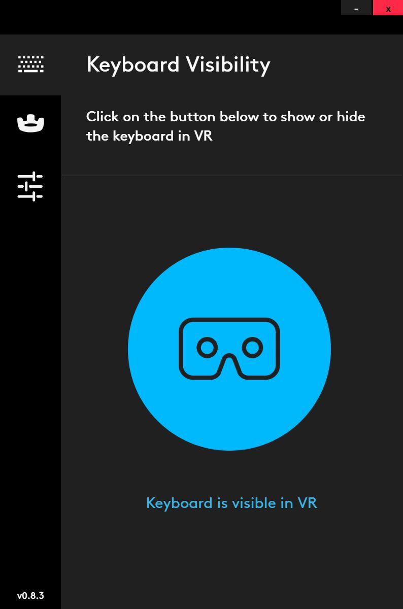
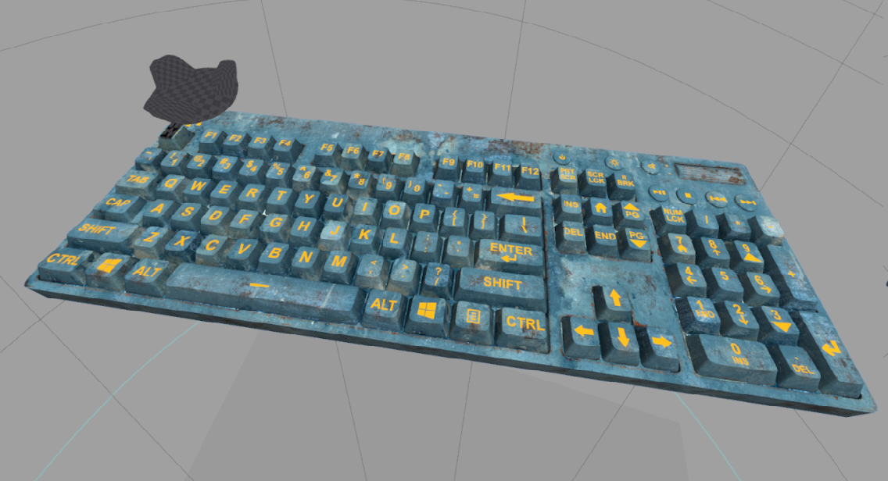

# Logitech Bridge SDK

Draft version 0.8.3

Last update May 10th

Contact: bridgesdk@logitech.com

## Introduction:
The Bridge SDK is a Development kit that aims at helping app makers and other SW developers to solve some of the issues arising whenever a person needs to use a Keyboard in VR.

## Motivation:
The motivation comes from the belief that in some situations the user still needs to use a keyboard to interact with the applications, especially in productivity-driven scenarios but also in games, chat and content browsing. We believe that that keyboard has to be physically present, since it delivers the traditional tactile experience and feedback that people value.

## The Pieces:
The Bridge SDK is composed of the following elements:

- A Logitech G810 Keyboard (off-the-shelf)
- A Logitech “BRIDGE adapter”
- A HTC tracker 
- A SW installer that enables an “overlay” of a 3D VR keyboard

## Setup instructions:
We are still working on an installer, so as of now you can simply head to the [installer](https://github.com/Logitech/logi_bridge_sdk/tree/master/installer) folder and download the [zip file](https://github.com/Logitech/logi_bridge_sdk/tree/master/installer/v083_Logitech_Bridge-win32-x64.zip) and unzip it on your machine (in any folder you like).

Read the supplied [documentation](https://github.com/Logitech/logi_bridge_sdk/tree/master/documentation/BRIGESDKdescription.pdf) for more detailed  instructions.

## Description of use:

### Overlay 3d VR Keyboard

The overlay package is fully compatible with all application that is developed based on STEAM VR (©Valve).

It is the SW piece that supports the Bridge SDK and allows the user to visualize/overlay a view of the virtual representation of the keyboard in any VR application game: It acts in fact as an additional “virtual” Headset that has his own view that is virtually placed right in front of the user’s HMD’s view.

It will render a 3D representation of a G810 keyboard, complete with animations when the keys are pressed.

The keyboard will appear as soon as the associated tracker is turned on (options to toggle visibility are available) and the user will be able to see it "floating" above any app.
