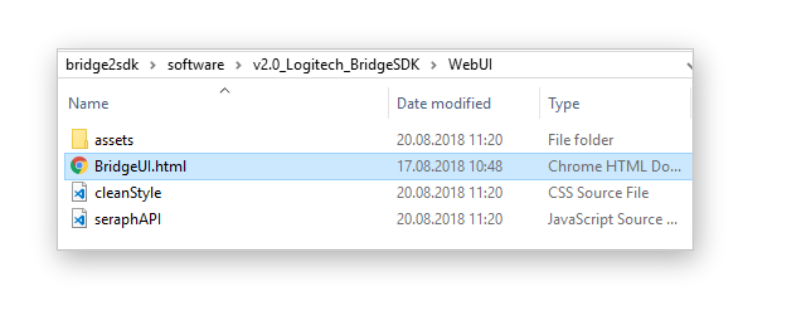

# Software releases

GitHub advises to keep large binary files out of source control, especially if those are intended to be part of a release package. This is the reason why we have removed the binary/exe/dll files from this software folder and moved it to the releases tab of this repository.

- get the latest release [here](https://github.com/Logitech/logi_bridge_sdk/releases)

# Prerequisites
Make sure you have gone through these preparation steps beforehand:

- you are on Microsoft Windows 10 (64bits)
- you have installed Steam and SteamVR
- you have a working Vive (1 or Pro) setup with at least one lighthouse (2 are preferred)
- in the steamVR settings (`SteamVR -> Settings -> Camera -> Test Camera Rate`) you have made sure the HMD's camera is enabled and working.
- you already have a paired HTC tracker to the system, so your steamVR dashboard should look like that:

# Download and run
Once you've downloaded the zip file, you can decompress it where you want, open the latest version folder (`vX.X_Logitech_BridgeSDK`) and then you'll have the following structure:

In order to run the software, simply double click on Logitech_Bridge.exe. A console window will appear with some debug information, you should leave it there.

## Software UI
We have provided a simplified UI in the form of a Web UI (can be loaded using a browser) Head to the folder containing the Logitech_Bridge.exe you just launched , enter the WebUI folder, and double click on BridgeUI.html

The Web UI should look similarly to this:

## Fine tuning
With the WebUI you can tweak your settings, such as toggling the visibility of the keyboard and hands, changing the skin (appeareance) of the keyboard. 
You can also fine tune the settings for the visualisation of your hands such as the `Hands transparency` level, the `Hands Visibility`'s' filtering amount and the `Noise Reduction` to remove some smaller particles/blobs from the video feed.

## Alignment
The system should already be quite well aligned, once you correctly attach the tracker to the adapter and at the keyboard. But if you feel that **your hands are not perfectly aligned** to the keys (in our experience a mis-alignment of 5mm is already quite unconfortable!) you should:

- in the `Hands Visualisation` mode, change the mode to `passthrough`
- use the `Tracker-Keyboard position` panel to adjust the X, Y and Z position of the video feed making sure it is **aligned with the borders of the viewing window** (which is the keyboard 3D model)
- switch back to `Luminance segmentation` in `Hands Visualisation` mode
- test that what you **see** matches to what you **feel** (ie your fingers feeling the correct keys below them).

If you still have issues or any other feedback, please reach out to us at supportsdk@logitech.com.
 
